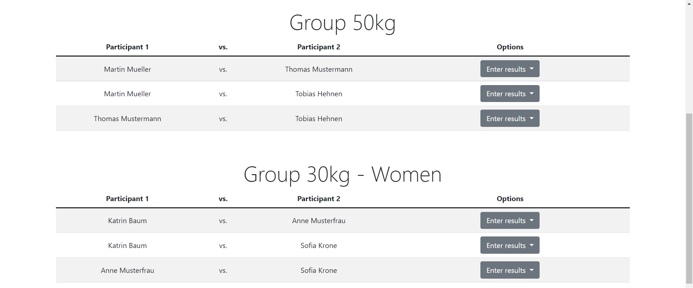
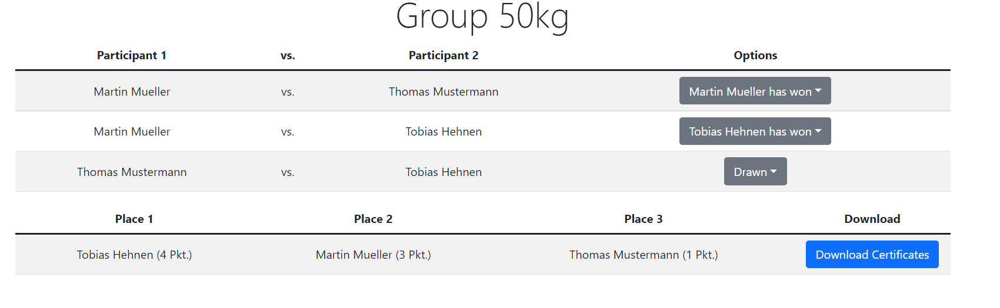
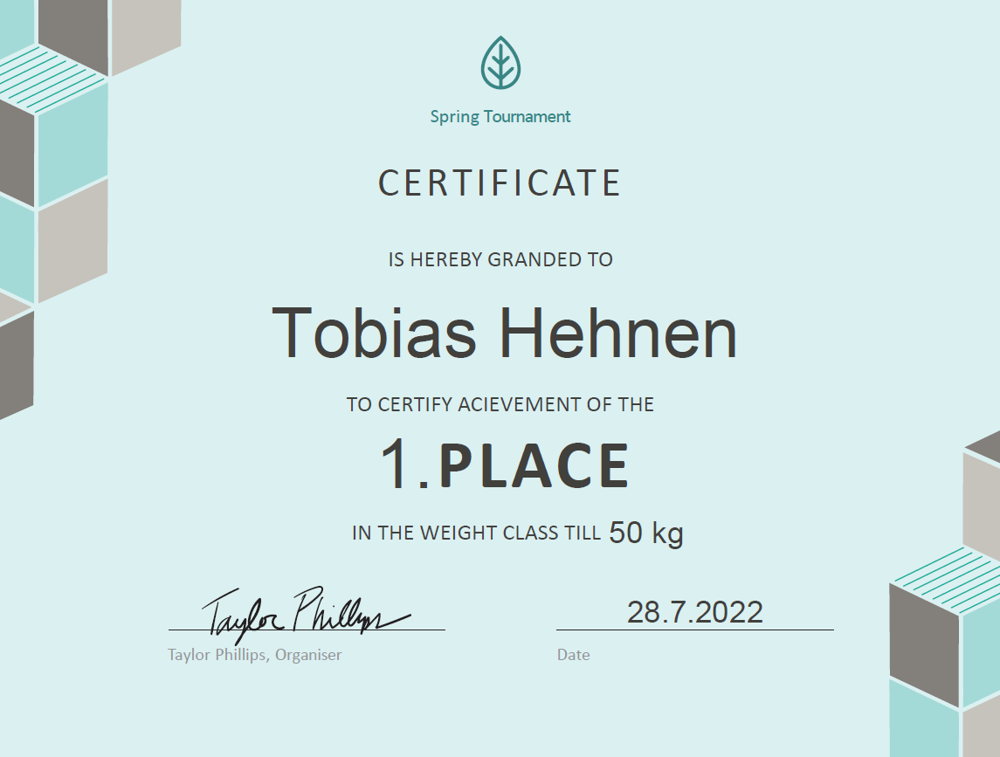

# TournamentsApp

## Motivation
This small web app was developed as we wanted to faster up the process of tournament planning, evaluation of the results and creation of certificates during organizing a tournament. 
This tool only needs a list of participants as a CSV file and then automatically calculates who has to compete against whom.
In addition, you can enter who has won to keep track of the results of each match, display for each 
group the overall results, and fastly create certificates containing the participant's place.

## Production
This small web app is currently hosted [here](https://tournamentsapp-app.web.app/) and can be tried out of the box!

## Usage
Start the browser and upload the CSV file. The file is supposed to have the following header:
````
GroupName,LastName,FirstName,WeightGroup
````

Example:
````
GroupName,LastName,FirstName,WeightGroup
Group 50kg (m),Müller,Martin,50
Group 50kg (m),Mustermann,Thomas,50
Group 50kg (m),Hehnen,Tobias,50
Group 30kg (w),Baum,Katrin,30
Group 30kg (w),Musterfrau,Anne,30
Group 30kg (w),Krone,Sofia,30
````

After loading the CSV file you will see the main screen containing all matches per each group. 



Use the dropdown menu on the right side of each row to keep track of the results of each match. As soon as all matches of one group are recorded, you see a result overview and get the possibility to download certificates for all participants within this group.







## Data Privacy
This app is constructed in a way that all data including the names are processed locally at the client, no data is sent to any server. That also means that you can disable your entire internet connection after the first site was loaded (even before using the "upload" function of the CSV file containing with the participants' names).

## Build Instructions
1. Install Node.js on your host.
2. Change into the project directory via Command Prompt.
3. Build the project and then start the local server:

```bash
npm i
npm run build
npm run start
```

Open [http://localhost:3000](http://localhost:3000) with your browser to see the result.

You can deploy this app e. g. to Firebase using ``npm run deploy`` if set up correctly.

## Technical description
This is a [Next.js](https://nextjs.org/) project.
